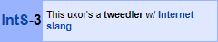

# Pengguna:Nattadasu (Sultan Iskandar Maulana)

*Baca dalam bahasa Inggris (Indonesia) di [README.md](README.md)*

**Halo, dan selamat datang di profil saya!**

  Saya Sultan Iskandar Maulana (alias Natsu Tadama), dan saya *cowo*. Berusia 19 tahun, dan juga seorang mahasiswa di prodi Komunikasi dan Penyiaran Islam di Universitas Islam Negeri Ar-Raniry, Banda Aceh, Indonesia.

  Saya dapat berbicara dalam lebih dari 5 bahasa: Aceh, Indonesia, Melayu, Inggris, Arab, dan Jepang... Dengan *plot twist*, saya dapat membaca alfabet Sirilik dan Hangul. Saya suka belajar bahasa asing, terutama bahasa Jepang; mengedit video, menonton anime (terkadang donghua) dan kartun barat, dan membuat situs internet menggunakan bahasa markah HTML. Sekarang saya memiliki proyek sumber terbuka mengenai basis data informasi tentang penayangan animasi dari berbagai negara dan situs, yakni [Ryuuganime](https://github.com/ryuuganime).

  Btw, saya punya banyak nama samaran selain dari nama asli saya; Natsu TADAMA, Alex TOMATSU, Nikolay Tolenka, Ryuusei NEKONE, dan Ryuusei RYUUZAKI.

## Statistik

    

   

### Spotify: sedang diputar

### Last&period;FM: baru diputar

## Donasi
> *Hai.*
>
> *Aing muka donasi. Oke, bro?*
>
> *Datang ka meja meja meja lami, bro. Bawa duid.*
>
>  — kucing garong

Liat "meja" yang dibilang sama kucing garong

<table>
<tbody>
<tr>
<td>DANA</td>
<td>085155315151</td>
</tr>
<tr>
<td>DOKU</td>
<td>1674820339</td>
</tr>
<tr>
<td>GO-PAY</td>
<td>085155315151</td>
</tr>
<tr>
<td>i.saku/Indomaret</td>
<td>085155315151</td>
</tr>
<tr>
<td>LinkAja</td>
<td>085155315151</td>
</tr>
<tr>
<td>OVO</td>
<td>085155315151</td>
</tr>
<tr>
<td>Sakuku</td>
<td>085155315151</td>
</tr>
<tr>
<td>Triv</td>
<td>085155315151</td>
</tr>
<tr>
<td>PayPal</td>
<td><a href="https://paypal.me/nattadasu">https://paypal.me/nattadasu</a></td>
</tr>
<tr>
<td>Yandex.Money</td>
<td><a href="https://money.yandex.ru/to/4100115392446184">https://money.yandex.ru/to/4100115392446184</a></td>
</tr>
<tr>
<td>Ko-Fi</td>
<td><a href="https://ko-fi.com/nattadasu">https://ko-fi.com/nattadasu</a></td>
</tr>
<tr>
<td>LiberePay</td>
<td><a href="https://liberapay.com/nattadasu">https://liberapay.com/nattadasu</a></td>
</tr>
<tr>
<td>Trakteer</td>
<td><a href="https://trakteer.id/nattadasu">https://trakteer.id/nattadasu</a></td>
</tr>
<tr>
<td>Bitcoin</td>
<td><code>33aBQqbMiuk53nKpZDC2dFBWKMwrbPNWcf</code></td>
</tr>
<tr>
<td>Ethereum</td>
<td><code>0x58d6f6c0b36ed033140801886d65a22899279110</code></td>
</tr>
<tr>
<td>Litecoin</td>
<td><code>MUGoxUc6PPUwMimNeM6RxPqb2uSPx9WgwS</code></td>
</tr>
<tr>
<td>Basic Auth. Token (BAT)</td>
<td><code>0x3E98817d5B4BB88C067b91Ae6Ebd6Bbf81d0D4BF</code></td>
</tr>
<tr>
<td>DASH</td>
<td><code>7a2WRBe3epDTadRKYpQtPjAdaW2HNMseqr</code></td>
</tr>
<tr>
<td>Ripple</td>
<td><code>rJc5d48m2pDdfurDaemUZT2J18RPcbtPGF</code> tag:<code>195482</code></td>
</tr>
</tbody>
</table>

## Kontribusi
Saya melakukan banyak kontribusi pada platform GitHub dan lainnya. Inilah beberapa kontribusi saya ☆ ～('▽^人)

### Ryuuganime
  

### Daftar

### Personalisasi
 

### Terjemahan
#### Bahasa Indonesia
     

-   [osu!player Plus](https://osu.ppy.sh/community/forums/topics/660418) oleh [- Founntain -](https://osu.ppy.sh/users/5105217), merupakan aplikasi pemutar musik berdasarkan beatmap osu! yang tersedia dalam mesin. Translasi ke Bahasa Indonesia.

#### Bahasa Melayu
 

#### Bahasa Arab

### Penguji coba versi 

## Kotak pengguna 

                                      

## Buku Tamu

Coba tandatangani ke buku tamu saya di [nattadasu/nattadasu#1](https://github.com/nattadasu/nattadasu/issues/1) (ﾉ◕ヮ◕)ﾉ\*:･ﾟ✧

<!--START:guestbook-->
> Tutturu~  here is my sign.. :smiley_cat: 
> -[@yezki](https://github.com/yezki)

> Signed by barbarbar338 :D
> -[@barbarbar338](https://github.com/barbarbar338)

> uwaaaaa
> -[@pampampam999](https://github.com/pampampam999)
<!--END:guestbook-->

## Aktivitas GitHub
<!--START_SECTION:activity-->
<!--END_SECTION:activity-->