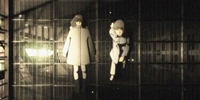

# 1. Natsu's Achievements
**Disclaimer**

This blog might take a lot of data to retrieving image from image hosting/server, please keep in mind to use unmetered connection.

## 1.1. Table of Content

* [1. Natsu's Achievements](#1-natsus-achievements)
  * [1.1. Table of Content](#11-table-of-content)
  * [1.2. mal-badges](#12-mal-badges)
  * [1.3. myshows Achievements](#13-myshows-achievements)
  * [1.4. Utopia Challenges](#14-utopia-challenges)
  * [1.4.1. Terebi](#141-terebi)
  * [1.5. AniList AWC Challenges](#15-anilist-awc-challenges)
  * [1.5.1. Seasonal Challenges](#151-seasonal-challenges)
  * [1.6. MyAnimeList Anime Watching Club Challenges](#16-myanimelist-anime-watching-club-challenges)
  * [1.6.1. Challenges Participant](#161-challenges-participant)
  * [1.6.2. Specific Elements, Genres, or Tags](#162-specific-elements-genres-or-tags)
  * [1.7. Anime-Planet Achievements](#17-anime-planet-achievements)
  * [1.8. malgraph Achievements](#18-malgraph-achievements)
  * [1.8.1. Anime](#181-anime)
  * [1.8.2. Manga](#182-manga)
  * [1.9. Shikimori achievements](#19-shikimori-achievements)
  * [1.9.1. Common](#191-common)
  * [1.9.2. BY GENRES](#192-by-genres)
  * [1.9.3. BY FRANCHISES](#193-by-franchises)

## 1.2. mal-badges 

I'm level  on [mal-badges](http://www.mal-badges.net). View my [badges](http://www.mal-badges.net/users/nattadasu).

## 1.3. myshows Achievements
   

## 1.4. Utopia Challenges 
### 1.4.1. Terebi 
 

## 1.5. AniList AWC Challenges 
### 1.5.1. Seasonal Challenges
   

## 1.6. MyAnimeList Anime Watching Club Challenges
### 1.6.1. Challenges Participant

### 1.6.2. Specific Elements, Genres, or Tags

## 1.7. Anime-Planet Achievements
                    

## 1.8. malgraph Achievements
### 1.8.1. Anime
                

### 1.8.2. Manga

## 1.9. Shikimori achievements
### 1.9.1. Common
                    

### 1.9.2. BY GENRES
                      

### 1.9.3. BY FRANCHISES
                