<html>
<head></head>
<body>
    <h1>1st Design Page</h1>
    
Dirancang menggunakan desain dari mod mode gelap <a href="https://kitsu.io">Kitsu</a>, halaman pengguna <a href="https://anilist.co">AniList</a>, dan <i>layout</i> dari <a href="https://www.twitter.com">Twitter</a>.

    
Tampilan di <i>readme</i> ini mungkin terlihat terputus-putus, tetapi akan tersambung secara otomatis pada MyAnimeList

     
    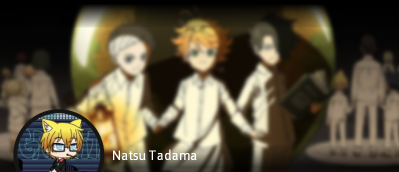
    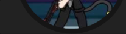<a href="https://myanimelist.net/animelist/nattadasu">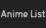</a><a href="https://myanimelist.net/mangalist/nattadasu">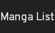</a><a href="">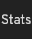</a>
    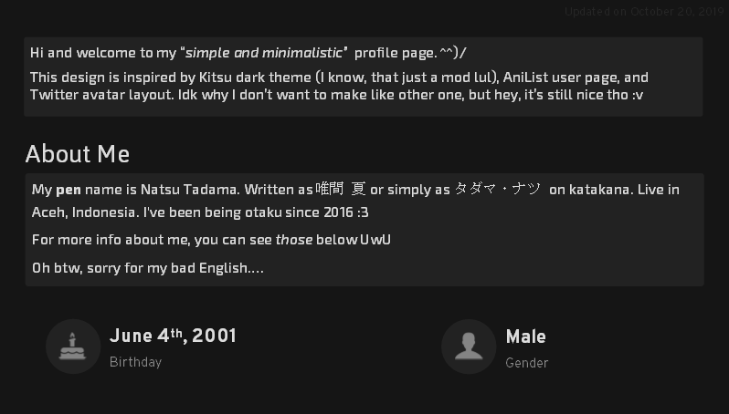 
    
    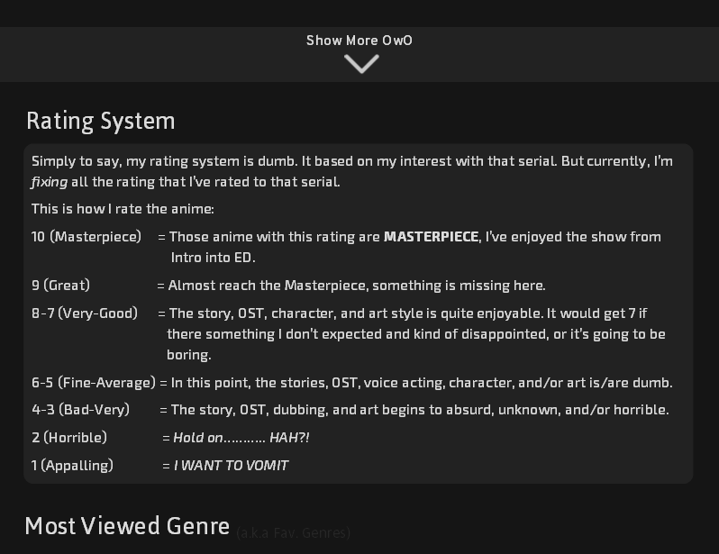 
    <a href="">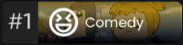</a><a href="">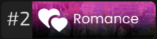</a>
     
    <a href="">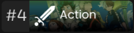</a><a href="">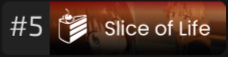</a><a href="">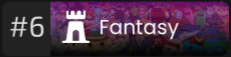</a>
    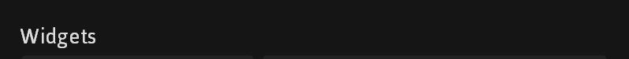 
    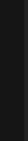<a href="">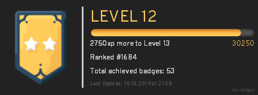</a>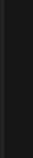
    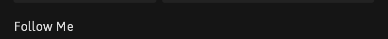 
    
     
    
     
    <a href="">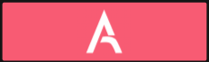</a><a href="">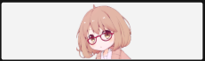</a>
     
    
    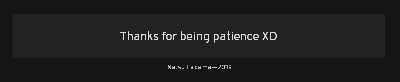
    

    
Hasil jadi:

    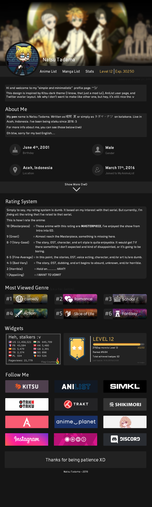
</body>
</html>
