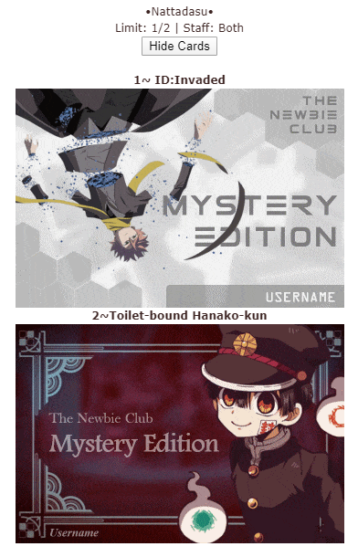

# GIF Troubleshooting
> Use this guide if you find any issue when placing the image to MyAnimeList

## Preface
Ok, in conclusion..... ngl tbh, **MyAnimeList [CDN](https://www.cloudflare.com/learning/cdn/what-is-a-cdn/) is weird as heck**. 
They don't allow you instantly put the animated GIF of mine to be rendered or load the image without the modification first...

I mean... look at this sh\*t lol >:(\

So I made this file to help you, ofc, solving the problem that you faced when embedding the image to MyAnimeList blog, forum post, or your bio.

This troubleshooting guide can also used for other type of animated GIF if you found MAL can't load properly the image.

## How-To Troubleshooting

1. Choose an animated GIF that appears corrupted, not load, or not rendered completely by MyAnimeList. For instance, I'll choose [my pre-modified card](042020-AmaneYugi/PhotoScape.gif) that doesn't load:\
\
The size of the card is 360 px width and 240px height.\
> NOTE: If you have GIF file and it's way too big, you can resize it first using PhotoScape X for Windows 10, or PhotoScape for other Windows version.
2. Go to [ezgif](https://ezgif.com) ([https://ezgif.com](https://ezgif.com)), and choose [GIF optimizer](https://ezgif.com/optimize). The purpose of optimizing animated GIF is to reduce the size of file with quality of image is reduced a little bit.
3. Upload the image, or if you have uploaded to a image hosting, you can copy image URL and paste it into the box. In this case, I've uploaded my card into personal GitHub repo, and place the image url into the box, and tap `Upload!`.\
\
Keep on mind that the maximum file size is 35 MB.
4. Scroll a little bit, keep the optimization method to default (`Lossy GIF`), but increase the "Compression level" up to 52-70. Also, the more level increased, will affect to the quality. So, please follow my step, for safest one.\
\
Then, tap `Optimize GIF!` below the slider
5. If optimizer finished optimized the image, click `Save`, and you done. OwO\
\
Doesn't work? Open Context menu on save button with clicking right button on your mouse, and click `Save Link as...`

The result? Here:\
\
Comparison? here lol\

As you can see here, the optimized version is having a lot of noise compared by "original" one... ~~but welp, I don't judge about that lmao~~.

And here the result on forum:\

Anyways, those all the steps lol. But, if you facing the same issue, first, you need to check... "is [x] site loaded perfectly on MAL?"\
In this case, I'd say... well MAL goes weird again at this one ;-;

Here's some sites I've tested to test "is [x] site loaded perfectly on MAL?"

| Site | Does It Works? |
| --: | :------------ |
| GitHub | Yes |
| s-ul.eu | Yes |
| Discord CDN | No, But its should be work lol |
| imgur | Yes |
| FunkyIMG | Yes |
| ImageShack | Yes |
| PostImage | Yes |

**[Testing blog](https://myanimelist.net/blog.php?eid=833627)**